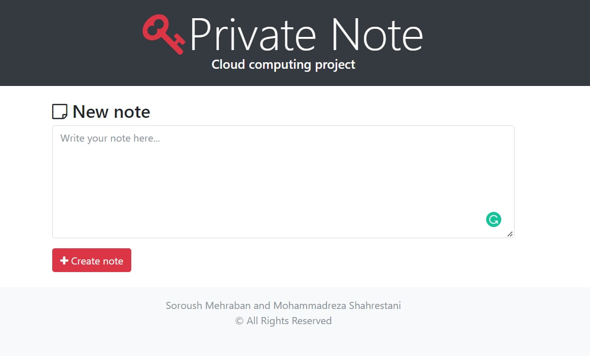

# Private Note - Cloud computing project

> **Instructor**: [Dr. S. A. Javadi](https://scholar.google.com/citations?user=Va7RTUsAAAAJ&hl=en)

> **Contributors**: Soroush Mehraban and Mohammadreza Shahrestani

> **Semester**: Spring 2022
## About

It's a simple project inspired from [Privnote.com](https://privnote.com).
## Steps
- [x] Implementing the webserver using Django.
- [x] Containerize the project by writing a Dockerfile and docker-compose (Multi-stage building) 
- [ ] Deploy the project on kubernetes
